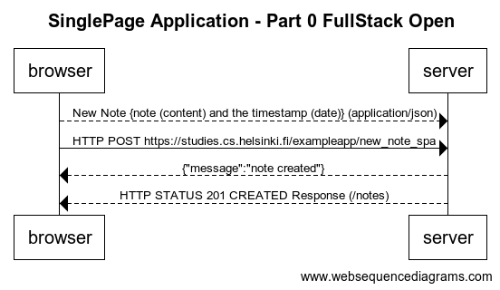

#title SinglePage Application - Part 0 FullStack Open

-browser-->server: New Note {note (content) and the timestamp (date)} (application/json)
-browser->server: HTTP POST https://studies.cs.helsinki.fi/exampleapp/new_note_spa
-server-->browser: {"message":"note created"}
-server-->browser: HTTP STATUS 201 CREATED Response (/notes)

